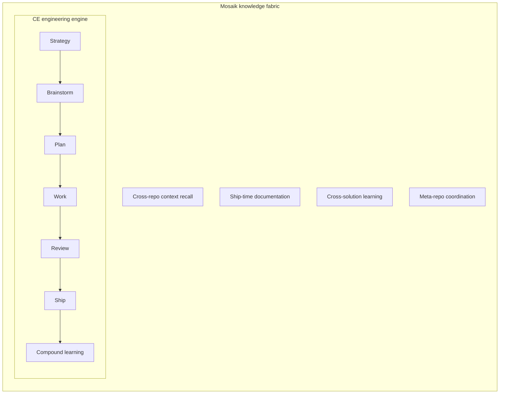
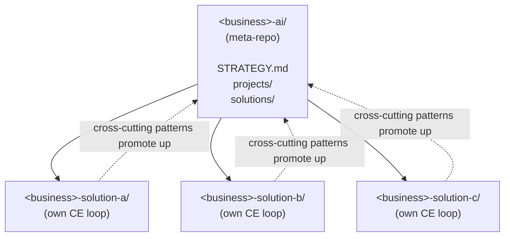

# Mosaik

**A methodology for AI transformation work in medium-sized businesses — built on Compound Engineering, designed for the messy reality of heterogeneous infrastructure.**

> *Two years ago, addressing the operational complexity of a medium-sized business meant hiring separate developers for each problem, each lacking the whole-business view. Today, one agent with whole-business context can emit per-problem solutions while preserving the unified picture. Mosaik is the methodology for running that pattern in practice.*

## What problem does Mosaik solve?

You run AI transformation work for a 10-50 employee business. You have:
- Multiple departments, each with their own pain points
- A patchwork of SaaS tools and bespoke systems (no single tech stack)
- One or two people responsible for driving AI adoption across all of it
- A nagging sense that piecemeal solutions don't add up to anything coherent

Mosaik gives you a methodology — and a small set of tools — for shipping **multiple AI solutions that compose into one coherent picture** of your business, rather than five disconnected tools that don't know about each other.

## Why not just use Compound Engineering?

[**Compound Engineering**](https://github.com/EveryInc/compound-engineering-plugin) (CE) is an open-source engineering methodology by Every — 17,000+ GitHub stars, in active use by many mid-sized businesses for software development. CE is excellent at structuring how a single feature gets shipped end-to-end: requirements → plan → autonomous execution → review → ship → captured learning.

**Mosaik is built on top of CE.** CE remains the engine. Mosaik adds what CE doesn't address out of the box:

- **Multi-solution coordination** — when one agent serves many operational solutions across one business, you need cross-solution context and learning
- **The meta-repo pattern** — a coordination layer for businesses where each solution lives in its own repo (different stack, different deployment, different security boundary)
- **Always-on context loading** — a search-and-recall layer (called QMD) lets the agent answer "what's our current state on X?" without reading every file
- **Ship-time documentation discipline** — auto-updated user-facing docs as solutions ship, not as a separate documentation task

You can use CE without Mosaik for a single-product team. Use Mosaik when you have multiple operational problems across one business and need them to talk to each other.

## How to run this

Mosaik runs in **[Claude Code](https://claude.ai/code)** — Anthropic's official agentic CLI. That's where it was designed and tested. It's also compatible with **OpenAI Codex CLI** through CE's official converter.

The methodology depends on a few things being installed:
- **Compound Engineering plugin** (v3.8.4 or later) — the engineering engine
- **QMD** — the markdown search daemon Mosaik uses for fast context recall
- **A markdown vault** (Obsidian works well; not strictly required)

You don't need any specific cloud, database, or multiple machines. Mosaik works on a single machine; how you sync work between environments is your operational choice, not part of the methodology.

For full setup details, see [TECHNICAL.md](TECHNICAL.md#runtime-requirements--dependencies).

## The shape of the methodology

**CE drives the per-feature cycle.** Mosaik wraps it with the cross-context awareness that makes multiple solutions add up to one business.

## The architecture at a glance

For businesses with multiple solutions across heterogeneous infrastructure, Mosaik prescribes a **meta-repo + per-solution repos** pattern:

The meta-repo holds shared strategic context. Each solution-repo runs its own engineering loop. Patterns that emerge across solutions promote up to the meta-repo at higher abstraction.

## Who is this for?

**Primary**: the operator-architect-builder at a medium-sized business doing AI transformation — one person (or small team) responsible for shipping AI solutions across multiple departments.

**Also relevant**: solo founders running multi-domain businesses; AI transformation consultants working with mid-sized clients; technical leads tracking how methodology evolves around agent-driven operations.

## Honest current state

Mosaik is **in development**. CE is the mature foundation Mosaik builds on (17,000+ GitHub stars, well-tested in production). The Mosaik-specific contributions — the fabric integration, the meta-repo pattern, the dual-loop framing — are new (May 2026), validated through real operator use across two contexts, reviewed twice by external AI for sharpness, but **not yet validated at broad community scale**.

We share Mosaik as inspiration. It's opinionated but not exclusive. Your context will have unique constraints; adapt accordingly.

## How to use this

If you're already comfortable with CE and just want the technical detail, jump to **[TECHNICAL.md](TECHNICAL.md)**.

If you're new to this entire space:

1. **Install Compound Engineering** from [the plugin repo](https://github.com/EveryInc/compound-engineering-plugin) — Mosaik depends on it.
2. **Read [TECHNICAL.md](TECHNICAL.md)** for the operational detail.
3. **Try it on one small solution.** Don't try to retrofit Mosaik onto everything at once.
4. **Adapt to your context.** The methodology is opinionated but not exclusive.

## Acknowledgements

- **Compound Engineering** by Kieran Klaassen / Every — the open-source engineering engine Mosaik builds on. CE's mature methodology + community made Mosaik possible.
- **Anthropic** for Claude Code + the AGENTS.md+shim cross-agent compatibility pattern.
- The community of operator-architect-builders who've shared their AI transformation experiences — Mosaik captures and extends patterns many people are independently arriving at.

## About this work

This repository contains no proprietary content from any company.

## License

MIT — see [LICENSE](LICENSE).

## Roadmap

See [roadmap.md](roadmap.md).
