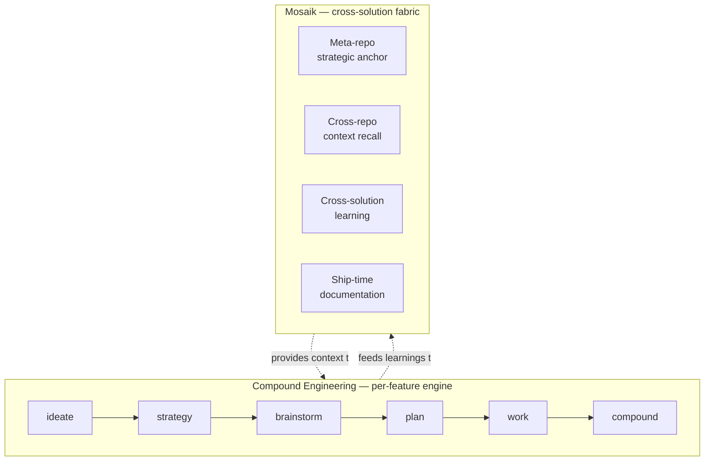
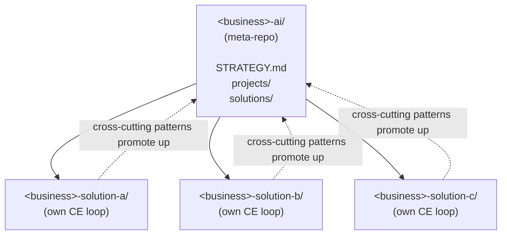

# Mosaik

**A framework for AI transformation work in medium-sized businesses — built on Compound Engineering, designed for the messy reality of heterogeneous infrastructure.**

> *Two years ago, addressing the operational complexity of a medium-sized business meant hiring separate developers for each problem, each lacking the whole-business view. Today, one agent with whole-business context can emit per-problem solutions while preserving the unified picture. Mosaik is the framework for running that pattern in practice.*

## What problem does Mosaik solve?

You run AI transformation work for a 10-50 employee business. You have:
- Multiple departments, each with their own pain points
- A patchwork of SaaS tools and bespoke systems (no single tech stack)
- One or two people responsible for driving AI adoption across all of it
- A nagging sense that piecemeal solutions don't add up to anything coherent

Mosaik gives you a framework — and a small set of tools — for shipping **multiple AI solutions that compose into one coherent picture** of your business, rather than five disconnected tools that don't know about each other.

**A "solution" here is whatever serves the operational need** — custom code, a SaaS integration, an API bridge between existing platforms, or an agent automating events. Mosaik prescribes the structural discipline, not the implementation shape; adopting Mosaik doesn't mean hand-coding everything.

*Mosaik becomes load-bearing the moment you start gathering requirements for your first solution.*

## Foundations + what Mosaik adds

Mosaik runs in **[Claude Code](https://claude.ai/code)** — Anthropic's official agentic CLI (also Codex-compatible via CE's converter). It integrates two established open-source tools with its own cross-solution layer.

### [Compound Engineering](https://github.com/EveryInc/compound-engineering-plugin) (CE) — the per-feature engine

17,000+ GitHub stars; in active use by many mid-sized businesses for software development. CE provides the structured cycle from stakeholder pain point to shipped solution:

- [`/ce-ideate`](https://github.com/EveryInc/compound-engineering-plugin/blob/main/docs/skills/ce-ideate.md) — frame the problem from stakeholder context
- [`/ce-strategy`](https://github.com/EveryInc/compound-engineering-plugin/blob/main/docs/skills/ce-strategy.md) — define the per-solution product anchor (vision, persona, metrics)
- [`/ce-brainstorm`](https://github.com/EveryInc/compound-engineering-plugin/blob/main/docs/skills/ce-brainstorm.md) — work through requirements with adversarial sub-agents that push back on weak framings
- [`/ce-plan`](https://github.com/EveryInc/compound-engineering-plugin/blob/main/docs/skills/ce-plan.md) — translate brainstorm into traceable implementation units
- [`/ce-work`](https://github.com/EveryInc/compound-engineering-plugin/blob/main/docs/skills/ce-work.md) — execute the plan with operator checkpoints
- [`/ce-compound`](https://github.com/EveryInc/compound-engineering-plugin/blob/main/docs/skills/ce-compound.md) — capture per-repo learnings as reusable patterns

Each step produces structured artifacts with stable IDs. **CE's discipline is the difference between shipping one feature and maintaining a portfolio** — scalable agentic engineering, not one-off vibe coding.

### [QMD](https://github.com/tobi/qmd) — the search substrate

Created by Tobias Lütke (Shopify founder/CEO); 25,000+ GitHub stars; in active development. A mini CLI search engine that indexes markdown for BM25 + semantic search across knowledge bases.

**Why it matters for agents**: context windows are finite, but the knowledge fabric isn't. QMD sifts through massive volumes of markdown — strategy, decisions, prior solutions, in-flight work — and returns *ranked* results combining keyword precision and semantic meaning. The agent doesn't get raw matches; it gets the right context, pre-filtered.

Mosaik uses QMD as the search substrate for `/recall`, so the agent recalls relevant context across the entire portfolio at every session start.

### Mosaik — the cross-solution layer

- **Meta-repo** (`<business>-ai/`) — the unified-view agent's [strategic home](TECHNICAL.md#the-meta-repo-pattern-for-heterogeneous-tooling-cases): business STRATEGY, per-solution summaries, cross-solution patterns. Holds the comprehensive business view — departments, stakeholders, pain points, prior decisions — that informs every per-solution decision downstream.
- **Per-solution repos** — each runs its own full CE loop with its own STRATEGY (referencing the meta-repo's). Brainstorms, plans, implementation, ship-time docs all live in the per-solution repo. **What lives inside is up to the solution shape**: custom-coded applications, integration layers wrapping a SaaS tool, API bridges between existing platforms, or agent runtimes invoked via agent-SDK or `claude -p` for automating business events. Patterns promote up to the meta-repo when they generalize.
- **[`/recall`](TECHNICAL.md#how-recall-integrates)** — the cross-repo context mechanism. When working in a per-solution repo, `/recall` loads the meta-repo's STRATEGY + relevant per-solution summaries + cross-solution patterns. The unified business view follows the agent into every per-solution session.
- **[Ship-time documentation](TECHNICAL.md#how-sd-ce-composes-with-ce)** — README, CHANGELOG, user docs, project summaries auto-updated as solutions ship. The product-management discipline that turns shipped code into adoptable solutions.

**The result: efficient and consistent solution delivery.** Solution N+1 ships informed by what solutions 1..N learned, and the agent always reasons with full business context when working on any single solution — because `/recall` brings it.

## How to run this

Mosaik runs in **[Claude Code](https://claude.ai/code)** — Anthropic's official agentic CLI. That's where it was designed and tested. It's also compatible with **OpenAI Codex CLI** through CE's official converter.

The framework depends on a few things being installed:
- **Compound Engineering plugin** (v3.8.4 or later) — the engineering engine
- **QMD** — the markdown search daemon Mosaik uses for fast context recall
- **A markdown vault** (Obsidian works well; not strictly required)

You don't need any specific cloud, database, or multiple machines. Mosaik works on a single machine; how you sync work between environments is your operational choice, not part of the framework.

For full setup details, see [TECHNICAL.md](TECHNICAL.md#runtime-requirements--dependencies).

## The shape of the framework

**CE drives the per-feature cycle.** Mosaik wraps it with the cross-context awareness that makes multiple solutions add up to one business.

## The architecture at a glance

For businesses with multiple solutions across heterogeneous infrastructure, Mosaik prescribes a **meta-repo + per-solution repos** pattern:

The meta-repo holds shared strategic context. Each solution-repo runs its own engineering loop. Patterns that emerge across solutions promote up to the meta-repo at higher abstraction.

## Who is this for?

**Primary**: the operator-architect-builder at a medium-sized business doing AI transformation — one person (or small team) responsible for shipping AI solutions across multiple departments.

**Also relevant**: solo founders running multi-domain businesses; AI transformation consultants working with mid-sized clients; technical leads tracking how methodology evolves around agent-driven operations.

## Honest current state

Mosaik is **in development**. CE is the mature foundation Mosaik builds on (17,000+ GitHub stars, well-tested in production). The Mosaik-specific contributions — the fabric integration, the meta-repo pattern, the dual-loop framing — are new (May 2026), validated through real operator use across two contexts, reviewed twice by external AI for sharpness, but **not yet validated at broad community scale**.

We share Mosaik as inspiration. The framework is opinionated but not exclusive. Your context will have unique constraints; adapt accordingly.

## Getting started

If you're already comfortable with CE and just want the technical detail, jump to **[TECHNICAL.md](TECHNICAL.md)**.

If you're new to this entire space:

1. **Install Compound Engineering** from [the plugin repo](https://github.com/EveryInc/compound-engineering-plugin) — the per-feature engineering engine Mosaik builds on.
2. **Install QMD** from [the QMD repo](https://github.com/tobi/qmd) — the search substrate `/recall` uses for cross-context recall across your knowledge fabric.
3. **Set up a markdown vault** for your knowledge fabric (Obsidian works well; any directory of markdown files is fine).
4. **Read [TECHNICAL.md](TECHNICAL.md)** for the operational detail — runtime requirements, doc-structure conventions, how the pieces compose.
5. **Try it on one small solution.** Don't try to retrofit Mosaik onto everything at once.
6. **Adapt to your context.** The framework is opinionated but not exclusive.

## Acknowledgements

- **Compound Engineering** by Kieran Klaassen / Every — the open-source engineering engine Mosaik builds on. CE's mature methodology + community made Mosaik possible.
- **QMD** by Tobias Lütke — the local markdown search substrate that makes cross-context recall actually fast.
- **Anthropic** for Claude Code + the AGENTS.md+shim cross-agent compatibility pattern.
- **Artem Zhutov** ([@artemxtech](https://artemxtech.substack.com/)) — for ["Grep is Dead: How I Made Claude Code Remember"](https://artemxtech.substack.com/p/grep-is-dead-how-i-made-claude-code), which articulated the QMD + hierarchical-collections + multi-mode `/recall` pattern that directly informed Mosaik's recall skill design.
- **Andrej Karpathy** — the [distilled CLAUDE.md guidelines](https://github.com/multica-ai/andrej-karpathy-skills) whose LLM coding principles informed parts of Mosaik's [agent collaboration principles](methodology/agent-collaboration-principles.md).
- The community of operator-architect-builders who've shared their AI transformation experiences — Mosaik captures and extends patterns many people are independently arriving at.

## About this work

This repository contains no proprietary content from any company. The framework synthesizes patterns from about a year of building AI solutions in two contexts — a medium-sized company's production AI work and a solo-operator's small business agent infrastructure — plus exposure to the broader agentic AI practitioner community's work on Claude Code + multi-project + knowledge-fabric patterns. Shared as inspiration, not as a definitive answer.

## License

MIT — see [LICENSE](LICENSE).

## Roadmap

See [roadmap.md](roadmap.md).
